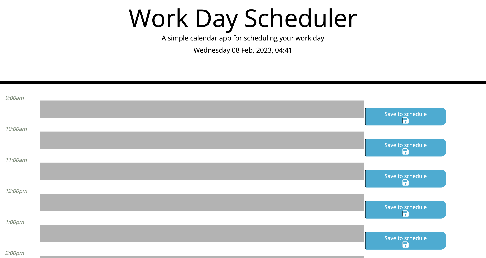
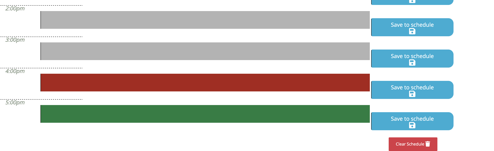

## Calendar Application - Work Schedule

## **What**
This project required me to create a daily planner style calendar application, where the user would be able to view a colour coordinated breakdown of the day, and could save their input into each hourly field. I was provided with some starter code, and I used this to create a functioning app alongside JavaScript, Moment.JS and jQuery.

The app was created with the following **User Story** in mind:

* AS AN employee with a busy schedule
* I WANT to add important events to a daily planner
* SO THAT I can manage my time effectively

## **How**
In order to create a user friendly and functioning app, I needed to include the following features:

* Display the current day at the top of the calendar when a user opens the planner.
* Present timeblocks for standard business hours when the user scrolls down.
* Color-code each timeblock based on past, present, and future when the timeblock is viewed.
*  Allow a user to enter an event when they click a timeblock.
*  Save the event in local storage when the save button is clicked in that timeblock.
*  Persist events between refreshes of a page.

As I tested the app, I became increasingly frustrated that I didn't have a button to be able to clear the page, so I utilised the code I had used to make a save button in order to create a 'clear schedule' button at the bottom of the calendar.

I also tweaked some of the CSS to improve my own learning, although this wasn't part of the challenge that was set.

## **Result**

## **Links**

The GitHub repository link:

https://github.com/Nikki1162/calendar-application

The live application:

https://nikki1162.github.io/calendar-application/